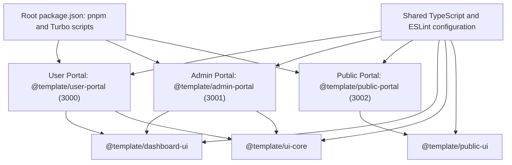

# Monorepo foundation

The repository is a pnpm workspace containing three independently deployable Next.js applications and five support packages. The separation allows a public marketing site, a user-facing product portal, and an administrator-facing portal to change and deploy independently while sharing frontend infrastructure.



Applications depend downward on reusable packages; packages do not depend on an application. This keeps product navigation, metadata, environment choices, and feature composition out of shared UI code.

## Workspace and versions

[`pnpm-workspace.yaml`](../../pnpm-workspace.yaml) includes `apps/*` and `packages/*`. Application manifests name local dependencies with `workspace:*`, for example `@template/user-portal` depends on `@template/dashboard-ui` and `@template/ui-core`. pnpm resolves those names to local workspaces. Each UI package has an `exports` entry for `.` pointing to its TypeScript root barrel (`src/index.ts`), so consumers use stable imports such as `@template/ui-core` rather than deep relative paths.

The same file has a `catalog` for the core dependency versions. Manifests use `catalog:` for Next.js, React, TypeScript, ESLint, Tailwind, and related dependencies. The committed [`pnpm-lock.yaml`](../../pnpm-lock.yaml) is lockfile version 9 and records the resolved dependency graph. The root manifest is the authority for the package manager: `pnpm@11.12.0` and Node `>=20.19.0`.

## Shared standards

`@template/typescript-config` supplies strict, no-emit compiler defaults in [`base.json`](../../packages/typescript-config/base.json); its Next.js variant adds JSX preservation, DOM libraries, incremental compilation, and the Next TypeScript plugin. Applications and UI packages extend it.

`@template/eslint-config/next` combines `eslint-config-next` Core Web Vitals and TypeScript configurations and ignores Next output, coverage, and the reserved generated API-client path. Application and UI-package ESLint files re-export that configuration. Root Prettier 3.9.5 and `prettier-plugin-tailwindcss` provide formatting via `pnpm format` and `pnpm format:check`.

## Turborepo execution

The root scripts delegate `dev`, `build`, `lint`, `typecheck`, and `test` to [`turbo.json`](../../turbo.json). `build`, `lint`, `typecheck`, and `test` each declare `dependsOn: ["^<task>"]`: Turbo first runs the same task in a workspace dependency, then in its consumer. Builds cache `.next/**` except `.next/cache/**`; development servers are persistent and deliberately uncached.

```text
pnpm build
  Turbo builds ui-core/dashboard-ui before user-portal and admin-portal,
  and public-ui before public-portal.

pnpm --filter @template/admin-portal test
  Runs only that application's Vitest suite.

pnpm dev
  Starts every workspace that defines a dev script; each Next server chooses
  its application-owned port.
```

The UI packages currently define lint and typecheck scripts, but no `build`, `test`, or `dev` scripts. Consequently, Turbo's dependency ordering is meaningful for their lint/typecheck tasks, while the apps' `build` tasks transpile their package source directly (see [Application architecture](./02-application-architecture.md)).

## Independent applications

Every application has its own package manifest, environment example, Next configuration, `.next` output, runtime command, Dockerfile, and standalone server. This is why the repository is not a single Next app with route groups: public-site dependencies and release timing do not need to be coupled to authenticated/dashboard bundles or their deployment boundary.

## Attribution

TailAdmin-derived material retains MIT notices in [`packages/ui-core/LICENSE.tailadmin`](../../packages/ui-core/LICENSE.tailadmin) and [`packages/dashboard-ui/LICENSE.tailadmin`](../../packages/dashboard-ui/LICENSE.tailadmin). Solid-derived public-site material retains MIT notices in [`packages/public-ui/LICENSE.solid`](../../packages/public-ui/LICENSE.solid) and [`apps/public-portal/LICENSE.solid`](../../apps/public-portal/LICENSE.solid). Preserve these package-level files when adapting or distributing the corresponding material.
