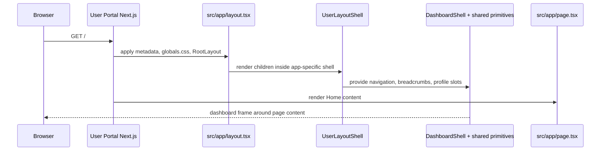

# Application architecture

The `apps/` directory holds three App Router applications. A route's `page.tsx` supplies page content; its root `layout.tsx` supplies document metadata, global CSS, and the app-specific composition shell. The shared packages do not decide which routes, navigation items, labels, or profile actions an application has.

| Application   | Package / port                   | Current responsibility                           | Shared UI                                     |
| ------------- | -------------------------------- | ------------------------------------------------ | --------------------------------------------- |
| User Portal   | `@template/user-portal` / 3000   | Self-service account and activity placeholders   | `@template/dashboard-ui`, `@template/ui-core` |
| Admin Portal  | `@template/admin-portal` / 3001  | Privileged operational placeholders              | `@template/dashboard-ui`, `@template/ui-core` |
| Public Portal | `@template/public-portal` / 3002 | Marketing routes and configurable public content | `@template/public-ui`                         |

## Routing, layouts, and request flow

The User and Admin portals presently have only `src/app/page.tsx`, although their navigation configurations list future destinations. A navigation link such as `/profile` or `/users` is not yet backed by a route file. The Public Portal implements `/`, `/features`, `/pricing`, `/about`, `/contact`, `/blog`, `/privacy`, and `/terms`, plus `not-found.tsx`, `robots.ts`, and `sitemap.ts`.

`apps/user-portal/src/app/layout.tsx` and `apps/admin-portal/src/app/layout.tsx` export title templates and descriptions, import their global stylesheets, and render `UserLayoutShell` or `AdminLayoutShell`. The Public Portal root layout sets `metadataBase` from `site.url`, canonical metadata, favicon metadata, `suppressHydrationWarning`, `PublicUiProvider`, and the shared public `Header` and `Footer`.

## Client and Server boundaries

Route pages and root layouts have no `"use client"` directive, so they can remain Server Components. The dashboard app-specific shells are Client Components because they use `usePathname` to choose active navigation and breadcrumbs. The interactive shared dashboard shell, sidebar context/sidebar, mobile navigation, and modal are also Client Components because they use React state, context, browser APIs, effects, or click handlers. The public provider and header are Client Components: `next-themes`, `useTheme`, `usePathname`, state, and scroll listeners require browser execution. A component being reusable does not by itself make it client-side.

## Local configuration and aliases

Each `tsconfig.json` maps `@/*` to that application's `src/*`; `@/config/site` in Public Portal and `@/config/navigation` in a dashboard app are local imports. `@template/*` imports name workspace-package public APIs. The User and Admin `config/env.ts` modules read and normalize `NEXT_PUBLIC_API_BASE_URL`, defaulting to `http://localhost:5000`. Public Portal additionally owns its user-portal URL and its branding/contact/site URL values in `src/config/site.ts`.

Environment values are application-owned—not a repository-wide runtime configuration system. The `.env.example` files document the current variables. `NEXT_PUBLIC_` values are public to browser bundles and should not hold secrets.

## Source package consumption and styling

All applications use `output: "standalone"` and retain TypeScript build errors. The dashboard apps configure `transpilePackages: ["@template/dashboard-ui", "@template/ui-core"]`; Public Portal configures `transpilePackages: ["@template/public-ui"]`. This tells Next.js to compile the local TypeScript source it receives through workspace exports.

Tailwind v4 is configured with PostCSS in each application. Dashboard `globals.css` imports the shared TailAdmin theme and declares `@source` paths for dashboard-ui and ui-core. Public Portal `globals.css` declares `@source` for public-ui and defines its Solid-derived theme. These source declarations ensure Tailwind sees shared-package classes and the application has the tokens that those classes use.

## Build and deployment boundary

Each application Dockerfile builds from the repository root, runs a filtered production build, then copies only its standalone output and static assets into a Node 20.19 Alpine runtime. The runtime uses the non-root `node` user and starts the corresponding `apps/<name>/server.js` on 3000, 3001, or 3002. Independent manifests, output folders, ports, and images make a change to one portal deployable without redeploying the others.
