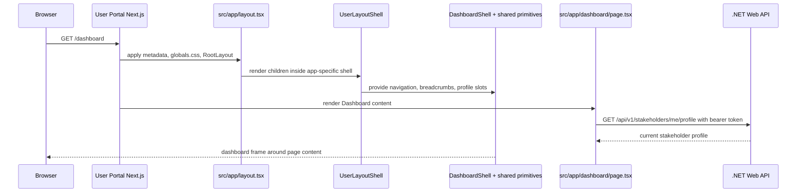

# Application architecture

The `apps/` directory holds three App Router applications. A route's `page.tsx` supplies page content; its root `layout.tsx` supplies document metadata, global CSS, and the app-specific composition shell. The shared packages do not decide which routes, navigation items, labels, or profile actions an application has.

| Application   | Package / port                   | Current responsibility                                            | Shared UI                                     |
| ------------- | -------------------------------- | ----------------------------------------------------------------- | --------------------------------------------- |
| User Portal   | `@template/user-portal` / 9000   | Authenticated account dashboard and self-service extension points | `@template/dashboard-ui`, `@template/ui-core` |
| Admin Portal  | `@template/admin-portal` / 9001  | Privileged operational placeholders                               | `@template/dashboard-ui`, `@template/ui-core` |
| Public Portal | `@template/public-portal` / 9002 | Marketing routes and configurable public content                  | `@template/public-ui`                         |

## Routing, layouts, and request flow

The User Portal uses `/dashboard` as its authenticated landing route and keeps `/` as a compatibility redirect. The dashboard reads the current stakeholder profile through the server-only API client, displays identity and verification status, and leaves explicit empty metric slots for later user-portal features. Its route-level `loading.tsx` and `error.tsx` own pending and failure presentation. The Admin portal implements `src/app/page.tsx`; both dashboard applications have separate `/sign-in` routes and navigation entries for some future destinations. A navigation link such as `/profile` or `/users` is not yet backed by a route file. The dashboard shells omit their authenticated navigation frame on `/sign-in`. The Public Portal implements `/`, `/features`, `/pricing`, `/about`, `/contact`, `/blog`, `/privacy`, and `/terms`, plus `not-found.tsx`, `robots.ts`, and `sitemap.ts`.

```mermaid
sequenceDiagram
  participant Browser
  participant Next as User Portal Next.js
  participant Layout as src/app/layout.tsx
  participant Shell as UserLayoutShell
  participant Shared as DashboardShell + shared primitives
  participant Page as src/app/dashboard/page.tsx
  participant API as .NET Web API
  Browser->>Next: GET /dashboard
  Next->>Layout: apply metadata, globals.css, RootLayout
  Layout->>Shell: render children inside app-specific shell
  Shell->>Shared: provide navigation, breadcrumbs, profile slots
  Next->>Page: render Dashboard content
  Page->>API: GET /api/v1/stakeholders/me/profile with bearer token
  API-->>Page: current stakeholder profile
  Shared-->>Browser: dashboard frame around page content
```

`apps/user-portal/src/app/layout.tsx` and `apps/admin-portal/src/app/layout.tsx` export title templates and descriptions, import their global stylesheets, and render `UserLayoutShell` or `AdminLayoutShell`. The Public Portal root layout sets `metadataBase` from `site.url`, canonical metadata, favicon metadata, `suppressHydrationWarning`, `PublicUiProvider`, and the shared public `Header` and `Footer`.

## Client and Server boundaries

Route pages and root layouts have no `"use client"` directive, so they can remain Server Components. The dashboard app-specific shells are Client Components because they use `usePathname` to choose active navigation and breadcrumbs. The interactive shared dashboard shell, sidebar context/sidebar, mobile navigation, and modal are also Client Components because they use React state, context, browser APIs, effects, or click handlers. The public provider and header are Client Components: `next-themes`, `useTheme`, `usePathname`, state, and scroll listeners require browser execution. A component being reusable does not by itself make it client-side.

The dashboard portals also own same-origin Route Handlers under `src/app/api/auth`. Their sign-in forms post credentials to `/api/auth/session`; the handlers translate those requests into handwritten `@template/api-client` operations and store access and refresh tokens in app-specific HttpOnly cookies. The Admin handler additionally requires the configured role claim before it writes cookies. Logout controls call the same endpoint with `DELETE`; each handler attempts backend termination and expires both portal cookies even when that backend session has already ended. Each dashboard's `src/proxy.ts` protects page routes before rendering, rotates a refresh-only session through the backend, and preserves the local destination when redirecting to that portal's public sign-in page. `src/lib/server-api.ts` creates a request-scoped server client, forwards only selected tracing metadata, reads the access token server-side, and defaults authenticated requests to `cache: "no-store"`. Browser components never import the server entry point or receive backend tokens. Public, CORS-approved browser calls can use the browser-safe `src/lib/api.ts` adapter.

## Local configuration, branding, and aliases

Each `tsconfig.json` maps `@/*` to that application's `src/*`; `@/config/site` in Public Portal and `@/config/navigation` in a dashboard app are local imports. `@template/*` imports name workspace-package public APIs. Every app's `src/config/env.ts` extends the shared `@template/config` browser schema with local values. `src/instrumentation.ts` validates the shared server schema at Next.js startup. See [shared configuration](./06-shared-configuration.md) for the exact variables and boundary rules.

Environment deployments remain application-owned—not a repository-wide runtime configuration system. Each `.env.example` documents the required server and browser values. `NEXT_PUBLIC_` values are intentionally public to browser bundles and must not hold secrets. Branding is supplied to layouts and reusable UI through each app's validated `branding` value, so a product rename, logo, colour, favicon, support email, copyright, or portal label does not require edits to shared components.

## Source package consumption and styling

All applications use `output: "standalone"` and retain TypeScript build errors. The dashboard apps configure `transpilePackages: ["@template/dashboard-ui", "@template/ui-core"]`; Public Portal configures `transpilePackages: ["@template/public-ui"]`. This tells Next.js to compile the local TypeScript source it receives through workspace exports.

Tailwind v4 is configured with PostCSS in each application. Dashboard `globals.css` imports the shared TailAdmin theme and declares `@source` paths for dashboard-ui and ui-core. Public Portal `globals.css` declares `@source` for public-ui and defines its Solid-derived theme. These source declarations ensure Tailwind sees shared-package classes and the application has the tokens that those classes use.

## Build and deployment boundary

Each application Dockerfile builds from the repository root, runs a filtered production build, then copies only its standalone output and static assets into a Node 22.13 Alpine runtime. The runtime uses the non-root `node` user and starts the corresponding `apps/<name>/server.js` on 9000, 9001, or 9002. Independent manifests, output folders, ports, and images make a change to one portal deployable without redeploying the others.
