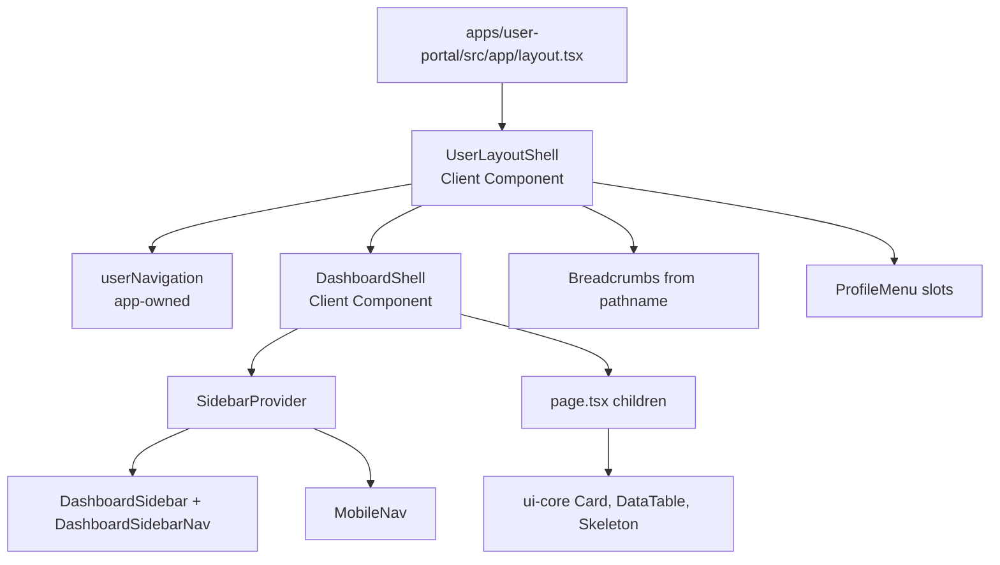

# Shared dashboard architecture

The dashboard applications share two packages with different responsibilities. `@template/ui-core` provides low-level, reusable dashboard primitives: cards, form controls, modal, pagination, skeleton, and generic `DataTable`. `@template/dashboard-ui` provides the dashboard frame and navigation-oriented components: `DashboardShell`, sidebars, mobile controls, breadcrumbs, header, and profile menu. Both expose these APIs from `src/index.ts` and retain TailAdmin attribution.

Neither package owns User Portal or Admin Portal navigation. `userNavigation` and `adminNavigation` remain in their respective `apps/*/src/config/navigation.ts` files; the apps pass them to shared components as typed `DashboardNavItem[]`. That is what prevents a privileged admin destination from leaking into user navigation. Their focused Vitest tests check that distinction.

## Composition trace

Admin Portal follows the same shape through `AdminLayoutShell`, but supplies its own navigation, labels, sidebar copy, breadcrumbs, and profile action slots. The architecture deliberately shares the frame while keeping product-specific composition local.

## Sidebar state and responsive behaviour

`DashboardShell` installs `SidebarProvider`, then `DashboardFrame` reads its state through `useSidebar`. The provider stores three pieces of state:

- `isExpanded`: desktop sidebar width is 290px when true and 90px when false.
- `isHovered`: a collapsed desktop sidebar becomes wide while hovered.
- `isMobileOpen`: on small screens the sidebar translates on screen and DashboardShell renders a backdrop button that closes it.

`DashboardSidebar` reacts to that state for width, translation, brand visibility, section label, and footer. `DashboardSidebarNav` renders supplied items, compares `item.href` with app-supplied `activeHref`, and uses the resulting active state for styling. `MobileNav` opens mobile navigation, toggles the desktop width, and manages the dashboard's local light/dark class: it reads `localStorage` or the system preference on mount, toggles `document.documentElement.classList`, and persists a `theme` value. `DashboardShell` offsets main content by the current desktop width.

These files use `"use client"` because React context/state, browser storage, media queries, and event handlers cannot execute in a Server Component. `Breadcrumbs`, `DashboardHeader`, and `ProfileMenu` themselves are reusable render components; their app-specific values are supplied by the shell.

## Theme and primitive boundary

`packages/dashboard-ui/src/tailadmin-theme.css` defines the shared TailAdmin-derived font, breakpoints, colors, shadows, and utilities. Both dashboard application global stylesheets import it and tell Tailwind to scan both shared source directories. `ui-core` uses those semantic Tailwind tokens but intentionally has no application theme import of its own.

Use `ui-core` for domain-neutral controls and display primitives. Use `dashboard-ui` for a reusable dashboard layout or navigation presentation. Put application labels, routes, profile data, permissions, and API-backed behaviour in an app. The current page tables are empty-state examples, not connected account, authorization, audit, or health workflows.
