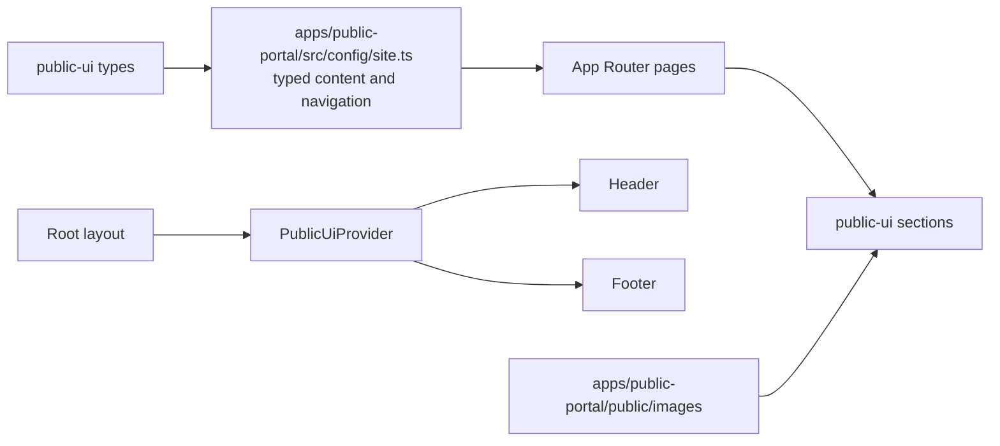

# Public portal architecture

`apps/public-portal` is a separately deployable marketing application. It depends on `@template/public-ui`, not on dashboard packages, so its `framer-motion` and `next-themes` dependencies do not become dependencies of the authenticated dashboard applications. Its source and assets are Solid-derived, with the required MIT notices preserved in both the app and package license files.

## Typed rendering and application-owned content

`packages/public-ui/src/types.ts` defines reusable props such as `LinkItem`, `FeatureItem`, `PricePlan`, `FaqItem`, `TestimonialItem`, `LogoItem`, and `BlogPost`. The package barrel exports those types plus reusable sections including `Hero`, `Features`, `Pricing`, `Faq`, `Testimonials`, `Header`, and `Footer`.

`apps/public-portal/src/config/site.ts` supplies the actual navigation, actions, branding, contact values, features, plans, FAQs, testimonials, logo assets, and posts. Pages compose that typed configuration into the shared sections. This is the key boundary: public-ui decides how a typed section renders; the application decides the site's wording, destinations, and which sections appear on a page.

The root layout wraps all pages with `PublicUiProvider`, `Header`, and `Footer`. `PublicUiProvider` uses `next-themes` to place the selected theme on the HTML class. The Header is a Client Component: it handles responsive menu state, active pathname styling, scroll-based sticky presentation, and theme changes. The remaining page composition can stay server-rendered.

## Routes, metadata, and assets

The landing page composes Hero, logo cloud, features, CTA, FAQ, testimonials, pricing, contact, and post cards. Feature, pricing, about, contact, and blog pages reuse shared components with page-level metadata; privacy and terms use app-local `LegalPage` placeholder content. `not-found.tsx` uses the bundled 404 asset. `robots.ts` and `sitemap.ts` derive URLs from `site.url`; sitemap values use the current build/request time for `lastModified`.

`layout.tsx` creates canonical metadata from `site.url`, selects `public/images/favicon.ico`, and wraps each route. Static images live under `apps/public-portal/public/images` and are referenced as `/images/...` through `next/image` or CSS.

## Styling and external destinations

The Public Portal global stylesheet imports Tailwind and declares `@source "../../../../packages/public-ui/src"`, allowing Tailwind to generate classes found in shared section source. It defines the app's Solid-derived tokens and dark variant. The public app’s `env.ts` normalizes `NEXT_PUBLIC_API_BASE_URL` and `NEXT_PUBLIC_USER_PORTAL_URL`; `userPortalHref` builds the Header sign-in/register destinations. The current unit test verifies that helper rather than a real authentication flow.

The current plans, legal text, testimonials, and contact content are explicitly configurable placeholders. No checkout, form submission, blog backend, account registration, API client, or authentication implementation exists in this epic scope.
