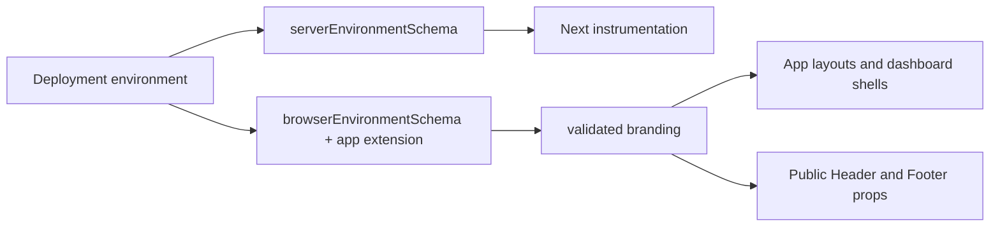

# Shared configuration

`@template/config` owns the schema and validation primitives that every application uses for runtime configuration. It is deliberately a reusable package: applications provide their own extension schema and explicit environment-variable mapping, preserving independent deployment and preventing shared infrastructure from deciding product behaviour.

## Environment boundary

`packages/config/src/index.ts` defines separate Zod schemas:

- `serverEnvironmentSchema` validates `API_BASE_URL`, `TENANT_ID`, `APP_ENVIRONMENT`, `APPLICATION_NAME`, and `APPLICATION_VERSION`. These are server-side values; secrets must use this boundary and must never have a `NEXT_PUBLIC_` prefix.
- `browserEnvironmentSchema` validates the equivalent intentional browser values with `NEXT_PUBLIC_` prefixes. A browser bundle can only receive values listed in each app's explicit mapping in `src/config/env.ts`.

Every app calls `createServerEnvironment` from `src/instrumentation.ts`, which Next.js runs on server startup. Its local `src/config/env.ts` extends the shared browser schema with the values that particular portal needs. Invalid or missing values produce a Zod error before the server accepts requests.

Copy the application-specific `.env.example` file to `.env.local` for local development. Production deployments must supply the same values through their deployment environment. The public and server values are intentionally separate even when they currently contain the same API URL and tenant ID, so a future private endpoint or secret cannot accidentally be exposed to the browser. Tenant IDs are validated UUIDs and default to `1203d9d1-2a6b-48ef-9cc1-e561a23aff72`; unlike an authentication token, this identifier is safe browser routing context.

## Branding composition

The shared package also validates the common branding contract: product and organization names, light/dark logo paths, favicon, primary/accent colours, support email, copyright notice, and all three portal names. Each app creates `branding` from this contract in its local environment module.

Root layouts consume that configuration for metadata, favicon, and colour CSS variables. Dashboard shells pass their configured product and portal names to reusable dashboard components. The Public Portal passes its configured logo and copyright to `@template/public-ui`'s `Header` and `Footer`; those shared components contain no product-specific asset path or product name.

This makes a consumer's rebrand an environment/configuration change, rather than a search-and-replace across shared components. Product-specific copy and navigation remain owned under the individual application `src/config/` directories.
