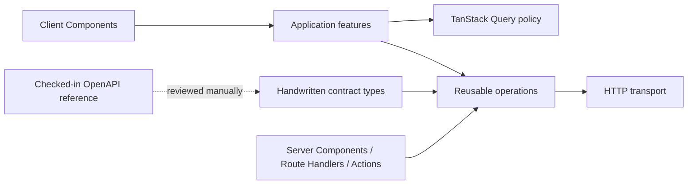

# Handwritten API client

`@template/api-client` is the reusable HTTP boundary between the three Next.js applications and `BackendProjectTemplate.WebAPI`. The package is handwritten: it contains no API client generator, generated source, React hooks, query keys, UI behaviour, or service-class hierarchy.

The checked-in [`backendprojecttemplatewebapi.json`](../../backendprojecttemplatewebapi.json) and the API running at `http://localhost:8080` are the contract references. Developers inspect that contract and update the relevant handwritten type, operation metadata, implementation, and tests together. `pnpm sync:openapi` refreshes the reference document; it does not create or modify API-client source.

## Ownership and dependency direction



The package owns base URL handling, request execution, serialization, authentication attachment, request metadata, timeouts, cancellation, response parsing, normalized errors, browser/server entrypoints, and reusable backend operations. Application features own TanStack Query keys and options, retries, invalidation, optimistic updates, forms, validation presentation, view models, toasts, redirects, and loading/error states.

The API client never imports an application. UI components never build backend URLs or implement raw transport. API response types are transport contracts, not automatically feature view models.

## Package layout and exports

Contract types are grouped into a small number of resource files under `packages/api-client/src/contracts/`: authentication, profiles, providers, reference data, payments, shared schemas, and webhook payloads. Operations live in matching resource folders. This avoids both a single enormous declaration file and one file per DTO.

Public imports are restricted by the package export map:

```ts
import { isApiError } from "@template/api-client";
import { signIn } from "@template/api-client/authentication";
import { createBrowserApiClient } from "@template/api-client/browser";
import { getWalletTransactions } from "@template/api-client/payments";
import { createServerApiClient } from "@template/api-client/server";
```

Consumers must not import internal paths. The root entrypoint is environment-neutral. The server entrypoint imports `server-only`, so importing it into a Client Component fails during a Next.js build. The browser entrypoint contains no cookie, private environment, or Next server imports.

## Transport instances

`createApiClient` creates an isolated client instance. Configuration is never stored in module-global mutable state, so concurrent server requests and tests cannot leak base URLs or credentials into each other.

Operations receive the client explicitly:

```ts
const client = createServerApiClient({
  baseUrl: serverEnv.API_BASE_URL,
  getAccessToken: () => accessToken,
});

const transactions = await getWalletTransactions(client, {
  Limit: 25,
  Cursor: nextCursor,
});
```

The transport interpolates encoded path parameters, serializes query values, sends JSON or native body types, applies the actual HTTP method, adds bearer and correlation headers, supports caller cancellation and timeouts, and handles JSON, text, malformed, and empty responses. It never retries a mutation automatically.

Server operations use the private `API_BASE_URL`. The browser client may use `NEXT_PUBLIC_API_BASE_URL` only for calls allowed by the deployment's CORS or same-origin gateway policy. The compatible backend currently has no CORS registration, so authenticated browser workflows use the BFF boundary described below.

Next.js-specific fetch caching remains opt-in through operation options. Authenticated request-time data should normally use `cache: "no-store"`; public Server Component data may choose `cache`, `next.revalidate`, or `next.tags` deliberately.

## Authentication and BFF boundary

The .NET API returns access and refresh tokens in response bodies and accepts bearer authentication. The User and Admin portals expose narrow Route Handlers for sign-in, Google sign-in, refresh, and logout. User Portal also exposes registration, confirmation, and password-reset handlers.

Successful session handlers store tokens in portal-specific `HttpOnly`, `SameSite=Lax` cookies. Cookies are `Secure` in production. Refresh tokens are never returned to browser JavaScript. `apps/*/src/lib/server-api.ts` reads the access-token cookie per request and attaches it through the server client. Refresh rotates both cookies and clears them when the backend rejects the refresh token.

This is not a catch-all proxy. Server Components and server-side application code call the .NET API directly. A new Route Handler or Server Action is added only when it protects a token, needs cookie mutation, composes a workflow, or provides another concrete server boundary benefit.

## Errors

All transport failures reject with `ApiError`, an `Error` subclass. It distinguishes cancellation, timeout, network failure, validation, unauthorized, forbidden, not found, conflict, rate limiting, server failure, and unexpected responses. It retains status, safe message, Problem Details fields, application code, validation errors, trace/correlation IDs, retry information, selected response metadata, request method/path, extensions, and the original cause.

Backend `detail` text is diagnostic data; features display `safeMessage` unless product review explicitly approves another message. The transport never redirects, renders a field error, opens a toast, or invokes an error boundary. Those choices belong to the consuming feature.

## Server Components and Client Components

Server Components create a request-scoped server client through the application adapter and call operations directly. They do not need TanStack Query.

Client Components should consume feature-owned query options or mutations. A feature that needs interactive server state can use the same operation:

```ts
import { getWalletTransactions } from "@template/api-client/payments";
import { queryOptions } from "@tanstack/react-query";
import { browserApi } from "@/lib/api";

export const walletQueries = {
  all: () => ["wallet"] as const,
  transactions: (filters: WalletFilters) =>
    queryOptions({
      queryKey: [...walletQueries.all(), "transactions", filters],
      queryFn: () => getWalletTransactions(browserApi, filters),
    }),
};
```

TanStack Query is not currently installed in the API package and must remain outside it. Add it to an application only when an implemented feature needs refetching, polling, interactive pagination/filtering, shared client-side server state, optimistic updates, or mutation-driven invalidation.

## Adding or changing an operation

1. Refresh or inspect `backendprojecttemplatewebapi.json`.
2. Update the appropriate handwritten module under `src/contracts/`, preserving exact optionality, nullability, parameter casing, and wire formats.
3. Add or update the method/path constant in that resource contract module.
4. Implement the reusable operation in the matching resource folder.
5. Export it through the resource's public `index.ts` and package export map if a new resource is introduced.
6. Add an MSW HTTP-boundary test that asserts method, path, parameters, body, and response behaviour.
7. Update this document when ownership, routing, authentication, or extension points change.

No source in this package is generated. Do not add Orval, Kubb, openapi-typescript, Hey API, a custom generator, generated hooks, generated clients, regeneration commands, or generated-drift CI checks.

## Verification

The package test suite uses MSW at the HTTP boundary and covers request serialization, headers, Problem Details, non-JSON failures, empty responses, timeout, cancellation, network failure, isolated clients, multipart upload, representative operations, and package boundaries.

Run:

```bash
pnpm --filter @template/api-client lint
pnpm --filter @template/api-client typecheck
pnpm --filter @template/api-client test
pnpm typecheck
pnpm build
```
