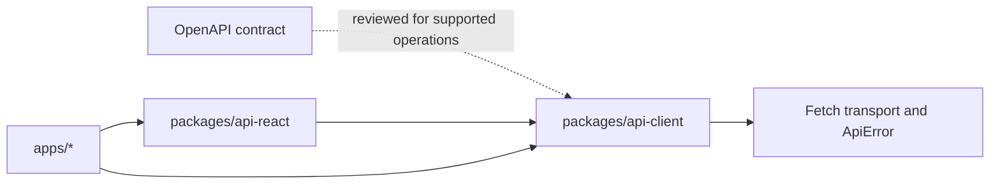

# Handwritten API client and React integration

Epic 6 implements two reusable packages. `@template/api-client` owns the HTTP boundary and handwritten backend contract; `@template/api-react` owns optional TanStack Query integration. Neither package contains generated code, feature-specific workflows, navigation, forms, or notifications.

The checked-in [`backendprojecttemplatewebapi.json`](../../backendprojecttemplatewebapi.json) and the Web API running at `http://localhost:8080/` are authoritative contract references. Developers inspect the OpenAPI document when implementing supported operations; it is never used to generate or overwrite TypeScript.

## Dependency direction and ownership



`packages/api-client` owns base-URL configuration, Fetch execution, JSON and multipart serialization, query/path encoding, authentication headers, correlation IDs, cancellation, response parsing, normalized errors, and domain operations. It has no React or TanStack Query dependency. Domain clients group operations for authentication, payments, profiles, providers, and reference data. Authentication includes email-existence checks, registration, and email confirmation as handwritten operations; inbound webhook endpoints are deliberately excluded because they are server-to-server callbacks, not browser operations.

`packages/api-react` owns reusable hierarchical keys, query and mutation options, signal propagation, cache lifetimes, invalidation, a client/query provider, and convenience hooks. Applications may import `@template/api-client` directly from Server Components, Server Actions, Route Handlers, scripts, or tests. They use query options for prefetching/hydration and hooks for interactive Client Components. The User Portal dashboard uses the request-scoped server client for `profiles.getProfile()` so its HttpOnly access token remains server-side; `currentProfileQueryOptions` and `useCurrentProfile` remain available for interactive same-origin compositions. Applications still own product workflows, form mapping, optimistic UI decisions, messages, toasts, and navigation.

## Client and transport

```ts
import { createApiClient } from "@template/api-client";

const api = createApiClient({
  baseUrl: "https://api.example.com",
  credentials: "include",
  getAccessToken: () => accessToken,
});

const countries = await api.referenceData.getCountries({ signal });
```

The aggregate client exposes `authentication`, `payments`, `profiles`, `providers`, and `referenceData`, plus the injected transport. Consumers needing one domain can import its interface and factory from a controlled subpath such as `@template/api-client/payments`. Low-level consumers can import `ApiTransport`, `ApiRequestOptions`, and `createFetchApiTransport` from `@template/api-client/transport`.

The default transport supports GET, POST, PUT, PATCH, DELETE, native `FormData`, caller headers, cookies, bearer tokens, generated or propagated correlation IDs, `AbortSignal`, timeouts, empty responses, and safe parsing. It does not redirect or retry on its own. Browser applications can opt into `createRefreshCoordinatedFetch` and supply their own refresh, session-expiry, and request-eligibility callbacks. Dashboard BFF applications can use `createBffSessionFetch` to build those callbacks from explicit session, authentication, and sign-in paths plus injected browser dependencies.

The compatible backend requires `X-Tenant-Id` on every request. Each application adds it through the API client's `defaultHeaders` option instead of repeating it in domain operations. Server clients and route guards read `TENANT_ID`; browser clients read `NEXT_PUBLIC_TENANT_ID`. Both values are validated as UUIDs by `@template/config` and default to `1203d9d1-2a6b-48ef-9cc1-e561a23aff72`. Deployments can override them together when they target another tenant.

Transport responsibilities are split under `packages/api-client/src/transport`:

- `fetch-api-transport.ts` orchestrates each request and exposes the HTTP methods.
- `build-request.ts` builds URLs, headers, authentication, correlation metadata, and bodies.
- `parse-response.ts` handles JSON, text, empty, and unreadable responses.
- `normalize-api-error.ts` maps backend and HTTP failures into `ApiError`.
- `request-cancellation.ts` composes caller cancellation with configured timeouts.

`src/client/request.ts` is only a compatibility export for existing consumers; new transport behaviour belongs in the focused transport modules.

## Error consumption

Every transport failure becomes `ApiError`. `kind` distinguishes cancellation, timeout, network failures, validation, authorization, missing resources, conflicts, rate limiting, server failures, and unreadable responses. The error retains status, title, safe message, backend detail/code, trace and correlation IDs, validation errors, `Retry-After`, selected response metadata, and a cause without exposing it as user-facing text.

Features should map `validationErrors` to known fields and retain unknown keys as general errors. They should display `safeMessage` by default and include `traceId` in support interactions. The client never opens a toast or couples errors to a form library.

## React Query usage

```tsx
const options = walletTransactionsQueryOptions(api.payments, { Limit: 25 });
await queryClient.prefetchQuery(options);

function Wallet() {
  const result = useWalletTransactions({ Limit: 25 });
  // Application code chooses loading, error, and presentation behaviour.
}
```

Wrap Client Component subtrees with `ApiProvider`, or consume exported options directly for prefetching and hydration. Query functions pass TanStack Query's signal to the client. Reference data has a long stale time; wallet data uses the shared default. Payment, profile, and provider mutations invalidate related key hierarchies. Authentication mutations do not own navigation or notifications, and logout clears cached server state after either success or failure when given a `QueryClient`. Applications can access that provider-owned client through `useApiQueryClient` for app-specific workflows such as portal logout.

## Adding, updating, or removing an operation

1. Run the compatible backend and execute `pnpm sync:openapi`, or set `BACKEND_OPENAPI_URL` to another approved controlled source.
2. Review the OpenAPI changes that affect operations consumed by the applications.
3. Update the domain request/response contracts, operation metadata, domain client method, and HTTP-boundary tests together.
4. Update query keys/options/hooks only if caching, invalidation, pagination, or React consumption changed.
5. For removal, first remove consumers, then the React integration, operation/client method, and contracts no longer shared.
6. Run `pnpm lint`, `pnpm typecheck`, `pnpm test`, and `pnpm build`.

CI deliberately does not require the frontend to implement or register every backend endpoint. It validates implemented behavior through transport and operation tests, React Query tests, application tests, type checking, linting, and production builds.

## Server and browser boundaries

The `@template/api-client/server` entrypoint is marked `server-only`; the browser entrypoint cannot read private environment variables, cookies, or tokens. Dashboard Route Handlers keep backend tokens in portal-specific HttpOnly cookies and use request-scoped server clients. This is a narrow BFF boundary, not a catch-all proxy. Public CORS-approved calls may use the browser client. The tenant identifier is routing context rather than a credential, so the browser-safe copy is intentionally public.

The browser entrypoint exports two procedural factories. `createRefreshCoordinatedFetch` owns one active refresh, one retry per failed request, the session version used by late 401 responses, and one active session expiration. `createBffSessionFetch` supplies the shared same-origin BFF mechanics: refresh and best-effort logout calls, authentication-route exclusions, and safe sign-in destinations. It receives every route and browser dependency explicitly and does not read application configuration.

The authentication entrypoint also exports framework-independent route-session helpers. `resolveRouteSession` accepts application-owned access validation and refresh callbacks, `hasActiveAccessToken` performs structural and time-window checks, `createSessionRefreshCoordinator` shares a rotating refresh operation between concurrent guards, and `createSignInRedirectUrl` builds a same-origin login redirect with the intended path and query. Each dashboard `proxy.ts` supplies its own cookie names, backend client, sign-in path, and Admin admission policy. The helpers do not read cookies, environment variables, or Next.js request state.

Each dashboard app keeps its authentication prefix, session path, sign-in path, and default browser bindings in `src/lib/session-fetch.ts`. That small app-owned wrapper is also the test boundary for injected Fetch, location, and redirect implementations. The Public Portal has no authenticated BFF session workflow and does not use either factory.

Public package exports are the supported extension points. Consumers must not import package internals or construct backend URLs in application features.
