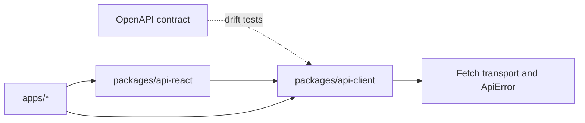

# Handwritten API client and React integration

Epic 6 implements two reusable packages. `@template/api-client` owns the HTTP boundary and handwritten backend contract; `@template/api-react` owns optional TanStack Query integration. Neither package contains generated code, feature-specific workflows, navigation, forms, or notifications.

The checked-in [`backendprojecttemplatewebapi.json`](../../backendprojecttemplatewebapi.json) and the Web API running at `http://localhost:8080/` are authoritative contract references. The OpenAPI document is inspected and tested, never used to generate or overwrite TypeScript.

## Dependency direction and ownership



`packages/api-client` owns base-URL configuration, Fetch execution, JSON and multipart serialization, query/path encoding, authentication headers, correlation IDs, cancellation, response parsing, normalized errors, and domain operations. It has no React or TanStack Query dependency. Domain clients group operations for authentication, payments, profiles, providers, and reference data; inbound webhook endpoints are deliberately excluded because they are server-to-server callbacks, not browser operations.

`packages/api-react` owns reusable hierarchical keys, query and mutation options, signal propagation, cache lifetimes, invalidation, a client/query provider, and convenience hooks. Applications may import `@template/api-client` directly from Server Components, Server Actions, Route Handlers, scripts, or tests. They use query options for prefetching/hydration and hooks for interactive Client Components. Applications still own product workflows, form mapping, optimistic UI decisions, messages, toasts, and navigation.

## Client and transport

```ts
import { createApiClient } from "@template/api-client";

const api = createApiClient({
  baseUrl: "https://api.example.com",
  credentials: "include",
  getAccessToken: () => accessToken,
});

const countries = await api.referenceData.getCountries({ signal });
```

The aggregate client exposes `authentication`, `payments`, `profiles`, `providers`, and `referenceData`, plus the injected transport. Consumers needing one domain can import its interface and factory from a controlled subpath such as `@template/api-client/payments`. Low-level consumers can import `ApiTransport`, `ApiRequestOptions`, and `createFetchApiTransport` from `@template/api-client/transport`.

The default transport supports GET, POST, PUT, PATCH, DELETE, native `FormData`, caller headers, cookies, bearer tokens, generated or propagated correlation IDs, `AbortSignal`, timeouts, empty responses, and safe parsing. It does not redirect on authorization errors and does not retry requests.

## Error consumption

Every transport failure becomes `ApiError`. `kind` distinguishes cancellation, timeout, network failures, validation, authorization, missing resources, conflicts, rate limiting, server failures, and unreadable responses. The error retains status, title, safe message, backend detail/code, trace and correlation IDs, validation errors, `Retry-After`, selected response metadata, and a cause without exposing it as user-facing text.

Features should map `validationErrors` to known fields and retain unknown keys as general errors. They should display `safeMessage` by default and include `traceId` in support interactions. The client never opens a toast or couples errors to a form library.

## React Query usage

```tsx
const options = walletTransactionsQueryOptions(api.payments, { Limit: 25 });
await queryClient.prefetchQuery(options);

function Wallet() {
  const result = useWalletTransactions({ Limit: 25 });
  // Application code chooses loading, error, and presentation behaviour.
}
```

Wrap Client Component subtrees with `ApiProvider`, or consume exported options directly for prefetching and hydration. Query functions pass TanStack Query's signal to the client. Reference data has a long stale time; wallet data uses the shared default. Payment, profile, and provider mutations invalidate related key hierarchies. Authentication mutations do not own navigation or notifications, and logout clears cached server state only when given a `QueryClient`.

## Adding, updating, or removing an operation

1. Run the compatible backend and execute `pnpm sync:openapi`, or set `BACKEND_OPENAPI_URL` to another approved controlled source.
2. Review the OpenAPI diff. Do not accept a changed fingerprint without understanding the schema change.
3. Update the domain request/response contracts, operation metadata, domain client method, and HTTP-boundary tests together.
4. Update `src/contract/operation-registry.ts`. Its schema fingerprints are review gates, not generated client source.
5. Update query keys/options/hooks only if caching, invalidation, pagination, or React consumption changed.
6. For removal, first remove consumers, then the React integration, operation/client method, contracts no longer shared, and registry entry.
7. Run `pnpm lint`, `pnpm typecheck`, `pnpm test`, and `pnpm build`.

The current backend document does not emit OpenAPI `operationId` values. Registry entries therefore use stable frontend identifiers and enforce method, path, parameters, schema references, and schema fingerprints. The optional `operationId` field is ready for strict comparison when the backend publishes stable identifiers; inventing values in the frontend would not make them authoritative.

## Server and browser boundaries

The `@template/api-client/server` entrypoint is marked `server-only`; the browser entrypoint cannot read private environment variables, cookies, or tokens. Dashboard Route Handlers keep backend tokens in portal-specific HttpOnly cookies and use request-scoped server clients. This is a narrow BFF boundary, not a catch-all proxy. Public CORS-approved calls may use the browser client.

Public package exports are the supported extension points. Consumers must not import package internals or construct backend URLs in application features.
