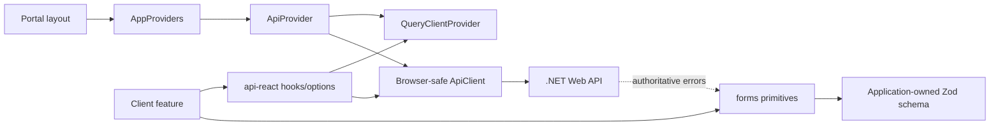

# Query and form infrastructure

Epic 7 completes the reusable server-state and form foundations without moving product workflows out of the independently deployable applications. `@template/api-react` owns TanStack Query policy and backend-operation integration. `@template/forms` owns domain-neutral React Hook Form and Zod composition. Applications continue to own schemas, screens, messages, redirects, and authorization-aware behavior; the backend remains authoritative for validation and access control.

## Runtime composition



Each portal has a local `src/components/app-providers.tsx`. It creates no cross-application runtime dependency: it combines that portal's `src/lib/api.ts` browser client with the reusable `ApiProvider`. The User and Admin portals are ready for authenticated same-origin operations, and the Public portal can adopt public queries without adding another provider later. Server Components and Route Handlers remain free to use `@template/api-client` directly.

## Query policy and keys

`packages/api-react/src/query-client/create-query-client.ts` is the single home for default cache and retry policy. Queries are fresh for 30 seconds and garbage-collected after five minutes. Window-focus refetch is disabled by default. Mutations are never automatically retried because repeating writes may be unsafe.

Queries retry at most twice for transient, network, or server failures. `ApiError` cancellation and HTTP client errors below 500 are not retried. This prevents validation, authentication, authorization, missing-resource, conflict, locked-account, and rate-limit responses from being repeated automatically. A feature can override defaults through its query options when an endpoint has a documented reason.

Keys are arrays rooted in a stable domain name and become more specific from left to right:

```ts
paymentKeys.walletTransactionList({ Limit: 25 });
// ["payments", "wallet-transactions", "list", { Limit: 25 }]
```

Key factories live with their domains under `packages/api-react/src`. Every reusable query is created through `getQueryOptions`, which accepts only operation metadata whose method is `GET` and repeats that check at runtime. This prevents POST, PUT, PATCH, or DELETE operations from inheriting query retries through an accidental query wrapper. Mutations invalidate the narrowest useful parent hierarchy. Logout clears all cached server state. TanStack Query Devtools render only when `NODE_ENV` is `development`.

## Form lifecycle

Application features define a Zod schema and infer or declare its field values, then combine `useValidatedForm`, `ValidatedForm`, connected fields, and `SubmitButton` from `@template/forms`:

```tsx
const schema = z.object({ email: z.email(), password: z.string().min(8) });
type Values = z.infer<typeof schema>;

const form = useValidatedForm<Values>(schema);

<ValidatedForm form={form} onSubmit={submit}>
  <TextField<Values> label="Email" name="email" type="email" />
  <PasswordField<Values> label="Password" name="password" />
  <SubmitButton pending={mutation.isPending}>Continue</SubmitButton>
</ValidatedForm>;
```

Validation starts after a field is touched and updates as the user corrects it. Native browser validation is disabled so messages have one predictable source. Fields associate labels, hints, and errors with the input, expose `aria-invalid`, announce errors, and provide an accessible password visibility control. The submit button uses both React Hook Form's `isSubmitting` and an optional mutation pending state to prevent duplicate submissions.

Zod gives immediate client guidance only. On an API failure, pass the `ApiError`, `setError`, and the feature's explicit field allow-list to `applyBackendValidation`. Backend keys are matched case-insensitively; known errors become field errors and unknown keys are returned for form-level display. This allow-list prevents unexpected backend properties from being treated as trusted form paths. Non-validation API failures use `safeMessage`. The server still decides whether data and actions are valid.

## Extension rules

- Put reusable backend operations and transport in `packages/api-client`; never construct backend URLs in a form.
- Put reusable query keys, options, hooks, cache policy, and invalidation in `packages/api-react`.
- Put domain-neutral form mechanics in `packages/forms` and visual input primitives in `packages/ui-core`.
- Put feature schemas, accepted backend-field lists, submit workflows, copy, notifications, navigation, and error presentation in the owning app.
- Never infer frontend authorization from a hidden field or a disabled button. The backend enforces authorization.
