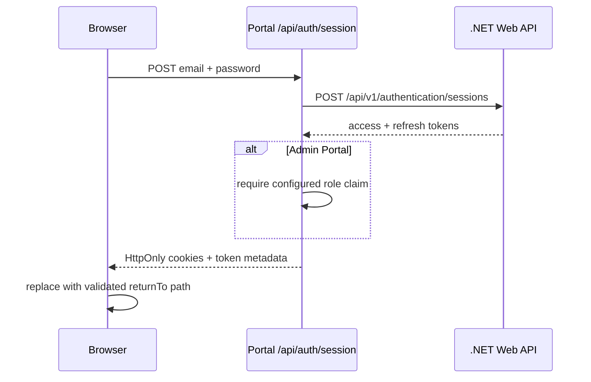

# Authentication and session management

FE-021 and FE-022 add application-owned credential sign-in and secure session storage to the independently deployed User and Admin portals. Both applications expose `/sign-in`, validate email/password input with `@template/forms`, and post only to their own `/api/auth/session` Route Handler. The browser never receives an access token or refresh token through JavaScript.

## Sign-in flow

The form maps response status to application-owned, safe messages. It does not render backend details, account identifiers, tokens, or exception text. `returnTo` accepts only a same-origin absolute path beginning with one slash; missing, external, protocol-relative, and malformed values fall back to `/`. This supplies destination restoration for route guards without creating an open redirect.

## Session cookie policy

Each portal stores the access and refresh token in separate cookies and reads them only from server-side Route Handlers or server API clients:

| Portal | Access token           | Refresh token                  |
| ------ | ---------------------- | ------------------------------ |
| User   | `__Host-user-session`  | `__Host-user-refresh-session`  |
| Admin  | `__Host-admin-session` | `__Host-admin-refresh-session` |

Every session cookie is `HttpOnly`, `Secure`, `SameSite=Lax`, `Path=/`, and high priority. The `__Host-` prefix requires `Secure` and `Path=/` and prevents a `Domain` attribute, so a deployment cannot broaden a cookie to sibling subdomains. User and Admin cookie names remain distinct even during local development, where ports do not isolate cookies.

Both cookies use the corresponding expiry returned by the backend minus a 60-second safety window. This avoids sending a token at the edge of its backend validity period and gives refresh coordination a consistent early-expiry signal. In particular, the refresh cookie is persistent rather than browser-session-only, so it remains available to the server-side refresh endpoint after a browser reload or restart until 60 seconds before the backend-defined refresh expiry. No authentication token is written to `localStorage` or `sessionStorage`; the dashboard theme is the only current `localStorage` consumer. FE-023 owns the request coordination that proactively refreshes an access token; the safety window alone does not initiate a refresh.

`src/lib/session-cookies.ts` centralizes creation and deletion. Login, Google login, and refresh rotation all call the same setter, while logout and terminal refresh failures call the same clearer. The setter and clearer also expire the pre-FE-022 `template.*` cookie names to migrate browsers safely. Local development uses secure cookies on `localhost`; non-local deployments must terminate HTTPS for browsers to accept the `Secure` cookies.

Later Epic 08 stories own route guards, refresh coordination, logout presentation, and permission-aware controls.

## Admin authorization boundary

The Admin Portal reads `ADMIN_REQUIRED_ROLE` as server-only configuration, defaulting to `Administrator`. After a successful backend credential/Google sign-in or token refresh, its Route Handler accepts the standard `role`, `roles`, or ASP.NET role-claim URI shape. A missing, malformed, or non-matching claim fails closed with `403`; rejected tokens are not persisted or returned to the browser, existing Admin cookies are cleared, and the handler makes a best-effort logout call.

This frontend check is an admission control for the Admin Portal, not a replacement for backend authorization on administrative APIs. The currently checked compatible backend token contains `jti`, `sub`, `email`, and `stakeholder_id` but no role claim, so it will be rejected by the Admin Portal until the backend emits the configured role (or supplies an equivalent backend-authoritative admin policy endpoint). That integration requirement is deliberate: authenticating successfully is not sufficient authorization for an administrative application.

## Extension points

- Add route protection by redirecting unauthenticated requests to `/sign-in?returnTo=<encoded local path>`; reuse the destination validation before redirecting back.
- Keep refresh and logout calls behind the existing same-origin session Route Handlers so token material stays server-only.
- Derive permission-based presentation from backend-authoritative session data when that contract is available, while continuing to enforce every privileged operation in the backend.
