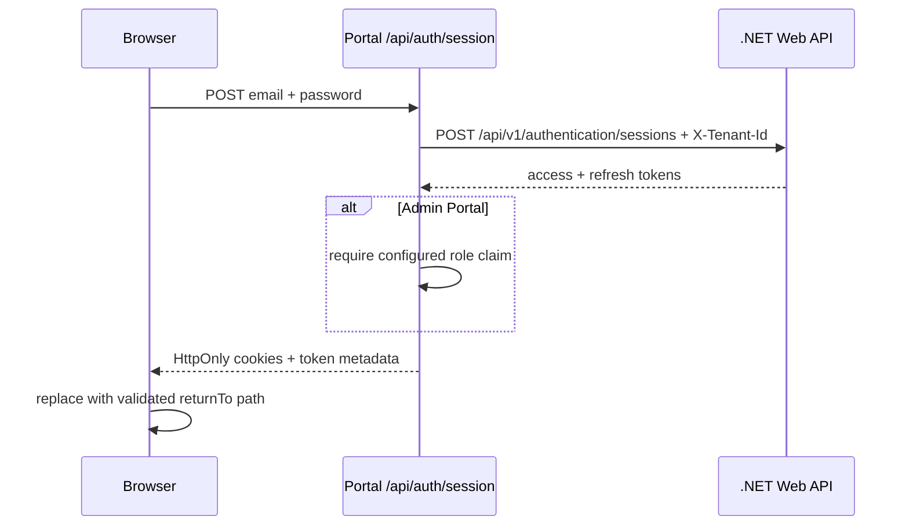
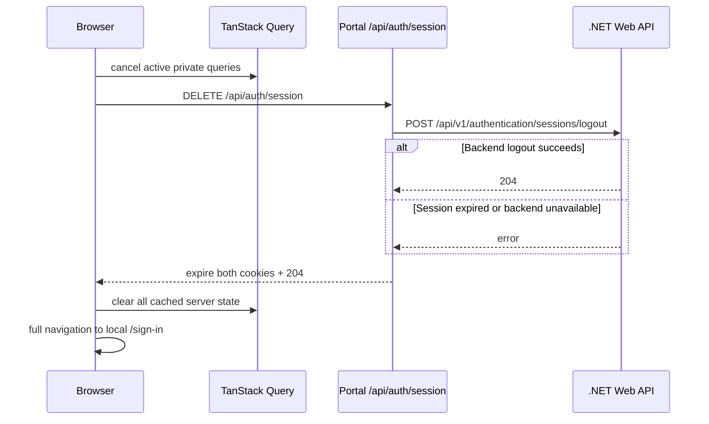
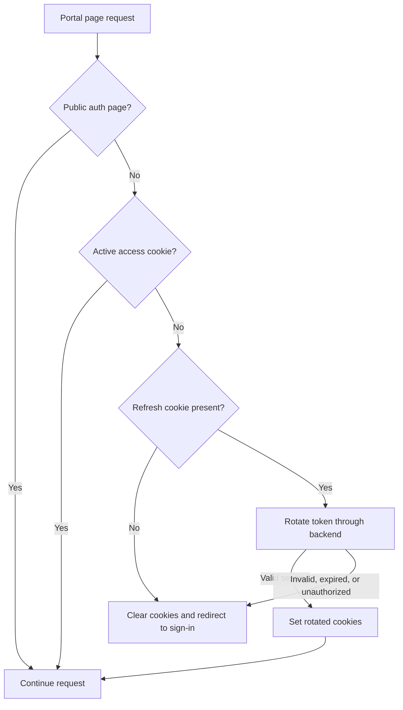

# Authentication and session management

FE-021 added sign-in to the User and Admin portals, FE-022 tightened session storage, FE-023 added coordinated refresh, FE-024 added explicit logout, FE-025 protected dashboard routes, and FE-030 added authenticated password changes to the User Portal. Each portal owns its `/sign-in` page, validates the form with `@template/forms`, and sends credentials to its own `/api/auth/session` Route Handler. The User Portal also owns the public `/register` and `/confirm-email` routes. Access and refresh tokens stay on the server side and are never returned to browser JavaScript.

## Sign-in flow

The form maps response status to application-owned, safe messages. It does not render backend details, account identifiers, tokens, or exception text. `returnTo` accepts only a same-origin absolute path beginning with one slash; missing, external, protocol-relative, and malformed values fall back to `/`. This supplies destination restoration for route guards without creating an open redirect.

When credential sign-in reports that the email is not confirmed, the User Portal does not leave the customer on an error state. It requests a confirmation code, carries the returned resend cooldown and validated `returnTo` destination into `/confirm-email`, and lets the customer complete verification. Successful verification creates the session and continues directly to the validated destination instead of returning to sign-in.

The portal's server API client adds the configured `X-Tenant-Id` header to sign-in, refresh, logout, registration, and every other backend operation. Route protection uses the same server tenant setting. The shared configuration defaults to the template tenant and still allows a deployment-specific override.

## Registration and email confirmation

The User Portal implements registration as an app-owned three-step workflow. It first posts the normalized email to `/api/v1/authentication/email-existence-checks`. Existing accounts are sent to `/sign-in` with a validated email query value, which pre-populates the email field and leaves the password field ready. New accounts continue to first name, last name, and a searchable country selector before creating their password on the final step. The selector reads public reference data and submits the selected country's UUID as `countryId`.

The password schema mirrors the Web API rules: at least eight characters with an uppercase letter, lowercase letter, digit, and non-alphanumeric character. Confirmation must match. This gives immediate guidance, while backend validation remains authoritative and is mapped back to the known fields.

The completed payload is sent through the handwritten `authentication.signUp` operation. An accepted registration navigates to `/confirm-email` with the email address and the backend's `retryAtUtc` cooldown. The page presents the six-character code as six coordinated inputs. It sends the combined value to its same-origin `/api/auth/email-confirmations` Route Handler, which calls the handwritten backend operation, stores the returned session tokens in HttpOnly cookies, and returns only non-sensitive session metadata to the browser. Its resend action remains disabled until five seconds after the backend timestamp to absorb small client/server clock differences, then calls `authentication.requestEmailConfirmationCode` and replaces the cooldown with the returned `retryAtUtc`. Successful confirmation continues directly to the validated destination; registration defaults to `/dashboard`. A conflict during the final registration request is treated like an existing-email result, covering the race between the initial check and submission.

## Session cookie policy

Each portal keeps the access and refresh token in separate cookies. Only Route Handlers and server API clients read them.

| Portal | Access token           | Refresh token                  |
| ------ | ---------------------- | ------------------------------ |
| User   | `__Host-user-session`  | `__Host-user-refresh-session`  |
| Admin  | `__Host-admin-session` | `__Host-admin-refresh-session` |

All four cookies are `HttpOnly`, `Secure`, `SameSite=Lax`, `Path=/`, and high priority. The `__Host-` prefix also prevents a `Domain` attribute, so these cookies cannot be widened to sibling subdomains. The User and Admin names are deliberately different because browser cookies are not isolated by port during local development.

Cookie expiry is the backend token expiry minus 60 seconds. That buffer stops the portals from using a token right at the edge of its validity and gives refresh coordination a clear point to refresh early. The refresh cookie is persistent, so reloading or reopening the browser does not lose it before that adjusted expiry. Authentication tokens are never written to `localStorage` or `sessionStorage`; the dashboard theme is the only current `localStorage` consumer.

`src/lib/session-cookies.ts` is the single place that creates and clears these cookies. Login, Google login, and refresh rotation use the same setter. Logout and terminal refresh failures use the same clearer. Secure cookies work on `localhost` during development; every non-local deployment must use HTTPS.

## Refresh coordination

Both portals export `authenticatedFetch` from `src/lib/api.ts` for client workflows that call a same-origin BFF endpoint. Each portal configures the reusable `createBffSessionFetch` helper from `@template/api-client/browser` with its authentication, session, and sign-in paths. The helper delegates concurrency and retry decisions to `createRefreshCoordinatedFetch`; neither helper replaces the global `fetch` function or attaches portal cookies to the backend API origin.

When an eligible request returns 401, the wrapper posts to `/api/auth/session/refresh`. Requests that fail together wait on the same refresh promise. A successful refresh rotates the cookies, increments an in-memory session version, and lets every waiting request retry once. The version check also covers a late 401 from a request sent before another request completed the refresh.

The retry uses the underlying Fetch implementation instead of calling the wrapper again. If that retry also returns 401, the session ends without another refresh attempt. Authentication routes, the sign-in page, and cross-origin requests never enter refresh coordination, which removes the other paths that could create a loop.

If refresh fails for any reason, the refresh Route Handler clears both cookies. The browser then makes a best-effort `DELETE /api/auth/session` call and redirects to `/sign-in` with the current local path in `returnTo`. Concurrent failures share that cleanup and redirect as well as the refresh request.

Authenticated client-side features must use `authenticatedFetch` for their same-origin Route Handler calls. The User Portal supplies that fetch implementation to its `browserApi` adapter and rewrites the profile update operation to `/api/profile`; public and CORS-approved operations retain their backend URLs. The local handler uses the server client to attach the HttpOnly access token, so browser JavaScript never receives authentication cookies or token material.

## Logout flow

Each portal adds an app-owned `LogoutButton` to its profile menu. `src/lib/logout.ts` cancels active queries, calls the same-origin session endpoint, clears the Query Client, and navigates to the current portal's `/sign-in` page. The full navigation resets React authentication and refresh-coordination state as well as the in-memory cache.

The Route Handler always attempts the backend logout operation. It also always expires that portal's access and refresh cookies and returns `204`, including when the backend reports an already-expired session or cannot complete the request. Local sign-out therefore does not depend on a usable access token or backend availability. The reusable `@template/api-react` logout mutation clears a supplied Query Client in `onSettled` for consumers that call the API client directly; portal navigation and safe error behaviour remain application-owned.

## Password change

The protected User Portal `/security` page collects the current password, a new password, and its confirmation. Local validation mirrors the registration policy and also requires the new password to differ from the current value. The form clears every password field after a successful change and displays only normalized, safe errors. Structured backend policy errors are mapped to the matching field; the application does not log or cache submitted password values.

Browser requests use the `authentication.changePassword` mutation, which the User Portal adapter rewrites to `PUT /api/security/password`. That same-origin Route Handler sits outside the reserved `/api/auth/` session-management prefix, so an expired access token enters the normal coordinated refresh-and-retry flow. The handler reads the HttpOnly session through the request-scoped server client and forwards `PUT /api/v1/authentication/password` with `{ currentPassword, newPassword, confirmNewPassword }`. The expected backend success response is `204 No Content`. The backend operation is the authoritative source for current-password verification and password-policy outcomes; its implementation and OpenAPI contract must use this shape before the integrated flow can succeed.

## Protected routes

Each dashboard app exports a Next.js `proxy` from `src/proxy.ts`. The matcher runs it for portal page requests while excluding authentication APIs, Next.js assets, and application static files. `/sign-in` is explicitly public in both portals; `/register` and `/confirm-email` are also public in the User Portal. Every other matched page is resolved before React rendering, so an unauthenticated request cannot briefly render the dashboard shell or page content.

`resolveRouteSession`, `hasActiveAccessToken`, and `createSignInRedirectUrl` live with the reusable authentication client. The access-token check rejects malformed tokens and tokens outside their `nbf`/`exp` window. Because the backend refresh token is opaque and rotating, the proxy sends it to `/api/v1/authentication/sessions/refresh` before admitting a request that no longer has an active access cookie. Concurrent guards in one portal process share that rotation through `createSessionRefreshCoordinator`; Admin renewal also repeats the configured role check before persisting the rotated session.

Redirects use the current portal origin and preserve the requested pathname and query in `returnTo`; URL fragments are not available in an HTTP request. The sign-in page applies its existing local-path validation before restoring that value. Failed guards clear both portal cookies. This proxy check prevents normal unauthenticated page rendering, but it does not replace backend authentication or authorization: private data must still come from backend endpoints that validate the signed access token and enforce the relevant policy.

Later Epic 08 stories own permission-aware controls.

## Admin authorization boundary

The Admin Portal reads `ADMIN_REQUIRED_ROLE` as server-only configuration, defaulting to `Administrator`. After a successful backend credential/Google sign-in or token refresh, its Route Handler accepts the standard `role`, `roles`, or ASP.NET role-claim URI shape. A missing, malformed, or non-matching claim fails closed with `403`; rejected tokens are not persisted or returned to the browser, existing Admin cookies are cleared, and the handler makes a best-effort logout call.

This frontend check is an admission control for the Admin Portal, not a replacement for backend authorization on administrative APIs. The currently checked compatible backend token contains `jti`, `sub`, `email`, and `stakeholder_id` but no role claim, so it will be rejected by the Admin Portal until the backend emits the configured role (or supplies an equivalent backend-authoritative admin policy endpoint). That integration requirement is deliberate: authenticating successfully is not sufficient authorization for an administrative application.

## Extension points

- Keep browser-initiated refresh and logout calls behind the existing same-origin session Route Handlers. Server route guards may use the handwritten server client directly; neither path exposes token material to browser JavaScript.
- Keep new public portal pages outside the proxy matcher or add an explicit public-path decision before rendering them.
- Derive permission-based presentation from backend-authoritative session data when that contract is available, while continuing to enforce every privileged operation in the backend.
