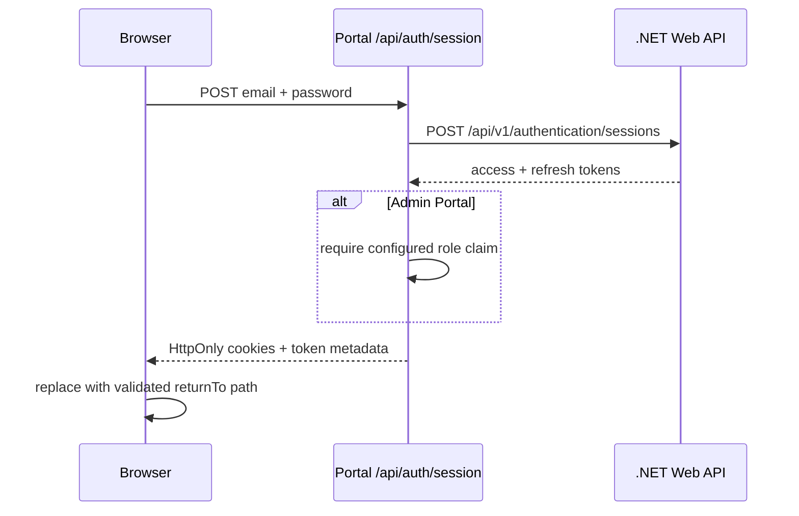

# Authentication and session management

FE-021 added sign-in to the User and Admin portals. FE-022 tightens how those portals store the resulting session. Each portal owns its `/sign-in` page, validates the form with `@template/forms`, and sends credentials to its own `/api/auth/session` Route Handler. Access and refresh tokens stay on the server side and are never returned to browser JavaScript.

## Sign-in flow

The form maps response status to application-owned, safe messages. It does not render backend details, account identifiers, tokens, or exception text. `returnTo` accepts only a same-origin absolute path beginning with one slash; missing, external, protocol-relative, and malformed values fall back to `/`. This supplies destination restoration for route guards without creating an open redirect.

## Session cookie policy

Each portal keeps the access and refresh token in separate cookies. Only Route Handlers and server API clients read them.

| Portal | Access token           | Refresh token                  |
| ------ | ---------------------- | ------------------------------ |
| User   | `__Host-user-session`  | `__Host-user-refresh-session`  |
| Admin  | `__Host-admin-session` | `__Host-admin-refresh-session` |

All four cookies are `HttpOnly`, `Secure`, `SameSite=Lax`, `Path=/`, and high priority. The `__Host-` prefix also prevents a `Domain` attribute, so these cookies cannot be widened to sibling subdomains. The User and Admin names are deliberately different because browser cookies are not isolated by port during local development.

Cookie expiry is the backend token expiry minus 60 seconds. That buffer stops the portals from using a token right at the edge of its validity and gives FE-023 a clear point to refresh early. The refresh cookie is persistent, so reloading or reopening the browser does not lose it before that adjusted expiry. Authentication tokens are never written to `localStorage` or `sessionStorage`; the dashboard theme is the only current `localStorage` consumer. The safety window does not refresh anything by itself—FE-023 will add that coordination.

`src/lib/session-cookies.ts` is the single place that creates and clears these cookies. Login, Google login, and refresh rotation use the same setter. Logout and terminal refresh failures use the same clearer. Secure cookies work on `localhost` during development; every non-local deployment must use HTTPS.

Later Epic 08 stories own route guards, refresh coordination, logout presentation, and permission-aware controls.

## Admin authorization boundary

The Admin Portal reads `ADMIN_REQUIRED_ROLE` as server-only configuration, defaulting to `Administrator`. After a successful backend credential/Google sign-in or token refresh, its Route Handler accepts the standard `role`, `roles`, or ASP.NET role-claim URI shape. A missing, malformed, or non-matching claim fails closed with `403`; rejected tokens are not persisted or returned to the browser, existing Admin cookies are cleared, and the handler makes a best-effort logout call.

This frontend check is an admission control for the Admin Portal, not a replacement for backend authorization on administrative APIs. The currently checked compatible backend token contains `jti`, `sub`, `email`, and `stakeholder_id` but no role claim, so it will be rejected by the Admin Portal until the backend emits the configured role (or supplies an equivalent backend-authoritative admin policy endpoint). That integration requirement is deliberate: authenticating successfully is not sufficient authorization for an administrative application.

## Extension points

- Add route protection by redirecting unauthenticated requests to `/sign-in?returnTo=<encoded local path>`; reuse the destination validation before redirecting back.
- Keep refresh and logout calls behind the existing same-origin session Route Handlers so token material stays server-only.
- Derive permission-based presentation from backend-authoritative session data when that contract is available, while continuing to enforce every privileged operation in the backend.
